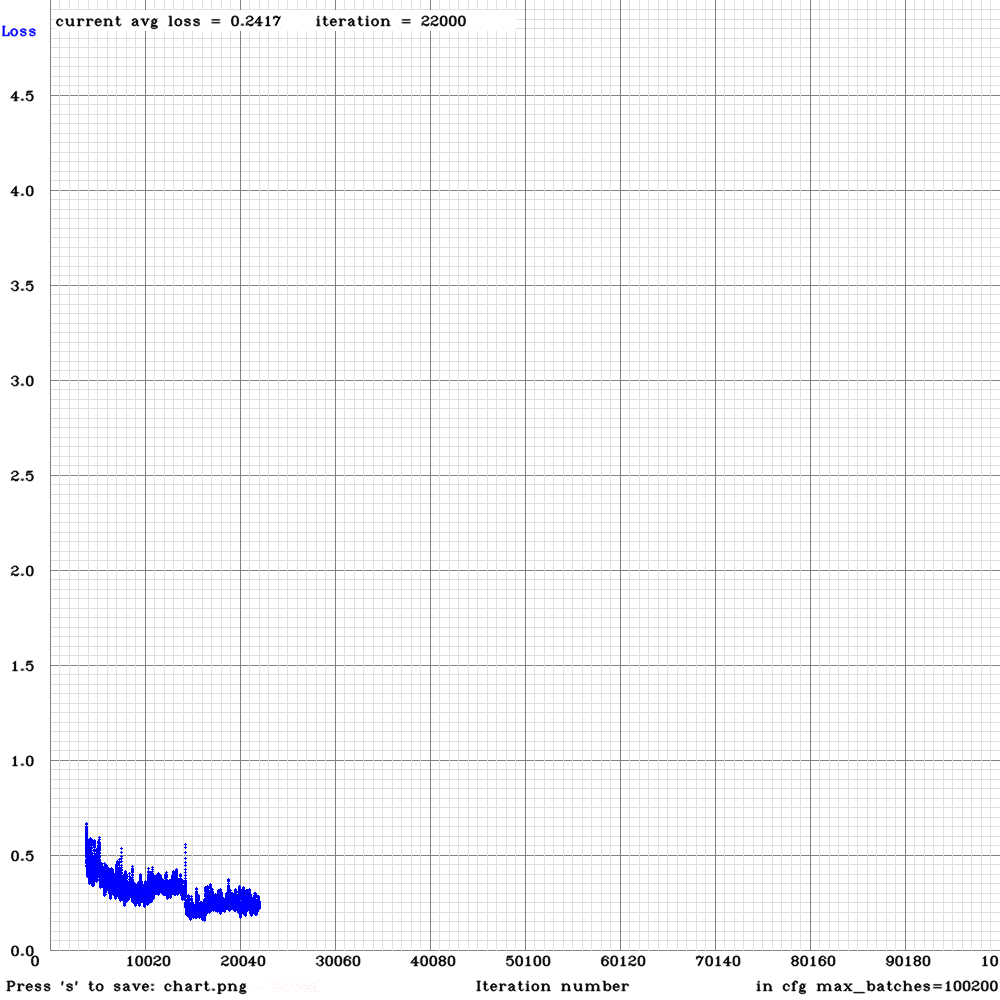

#  Talking Hands
  Recent years has seen enormous advancement in Machine Learning. Systems developed using machine learning algorithms are increasing in number which brings transformative advances in various real-life scenarios. These advancements also increase the quality of communication among people, but people with speech or hearing impairment face numerous challenges while communicating. Real-time communication with speech and hearing impaired has always been a challenge.
  Talking hands is a system that would assist a person with voice disorder to convert their actions into words and eventually into a sentence. It’s a system which helps people with speech and hearing impairment to convey their message. The system recognizes the various gestures made by the disabled person and ultimately help him build up a sentence in the text form with the help of Machine Learning, the system will be able to predict signs shown by the person with a disability and also help them translate the sentence into other languages. The system will also suggest some words which will eventually help the user in developing the sentence with ease.

## Getting Started

These instructions will get you a copy of the project up and running on your local machine for development and testing purposes. See deployment for notes on how to deploy the project on a live system.


### Prerequisites

```
1. A proper functioning WebCam.
2. A good CPU and GPU.
3. Atleast 8GB of RAM
4. 1GB of Memory space to store the Software
5. Python
```

### Installing

As we want to use YOLO V3 for Object Detection, we used [AlexeyAB's YOLO V3 Repository](https://github.com/AlexeyAB/darknet)
If anyone wants to custom train the YOLO Object detector on their own dataset can do so by just following the steps mentioned by [AlexeyAB](https://github.com/AlexeyAB/darknet) in the respository.

The Talking Hands Software can be downloaded by just clicking [Here]()

## Final Loss Graph


## Built With

* [Yolo](https://pjreddie.com/darknet/yolo/) - The YOLO Object Detector
* [AlexeyAB's GitHub repository](https://github.com/AlexeyAB/darknet) - GitHub repository of YOLO by AlexeyAB
* [Dataset from Kaggle](https://www.kaggle.com/grassknoted/asl-alphabet) - Used to train the Yolo Object detector
* [Yolo Annotation Tool](https://github.com/ManivannanMurugavel/YOLO-Annotation-Tool) - YOLO Annotation Tool by Mannivannan Murugavel
